  

---

### About

Backend developer specializing in Ruby on Rails with full-stack experience.

Built and deployed production-ready services, including multiple Telegram bots and full-stack applications using Rails and Nuxt. Experienced in designing backend architecture, API development, and integrating frontend systems.

Also comfortable with Python/Django — have hands-on experience in both ecosystems and feel confident working in them. Happy to work across different languages and stacks, with a focus on practical, scalable solutions. Always open to experiments.

**[Mikoshift](https://github.com/Mikoshift)** — personal organization with my own projects.

---

### Projects

|                                                                                   | Project                                                                      | Description                                               | Stack                                 |
| --------------------------------------------------------------------------------- | ---------------------------------------------------------------------------- | --------------------------------------------------------- | ------------------------------------- |
|  | [**natsu**](https://github.com/Mikoshift/natsu)                             | Mobile japanese reader (Mikoshift)                             | Dart, Flutter, Rust                          |
|     | [**natsu-web**](https://github.com/Mikoshift/natsu-web)             | Nuxt web client for Natsu (Mikoshift)                   | Nuxt, Vue, TS                               |
|  | [**natsu-rails-backend**](https://github.com/Mikoshift/natsu-rails-backend)                     | Rails backend for Natsu (Mikoshift)                        | Rails, Ruby, PostgreSQL                    |
|        | [**chessie**](https://github.com/MikoMikocchi/chessie)                       | Desktop chess app with AI and analyzer                    | Python, C++, Qt                       |
|       | [**Macbooru**](https://github.com/MikoMikocchi/Macbooru)                     | Native macOS client for Danbooru                          | Swift, SwiftUI                        |
|      | [**ollamassistant**](https://github.com/MikoMikocchi/ollamassistant)         | Browser extension: overlay access to local Ollama models  | Svelte, TypeScript                    |
|      | [**docker-constructor**](https://github.com/MikoMikocchi/docker-constructor) | Visual docker-compose builder inspired by n8n             | TypeScript, Next.js                   |
|        | [**pretty-git**](https://github.com/MikoMikocchi/pretty-git)                 | CLI report generator: activity, authors, languages, churn | Ruby                                  |
|        | [**homebrew-tap**](https://github.com/MikoMikocchi/homebrew-tap)             | Personal Homebrew tap for distributing tools              | Ruby                                  |
|       | [**nix-config**](https://github.com/MikoMikocchi/nix-config)                 | Full NixOS / Home Manager system configuration            | Nix                                   |
|     | [**2048-haskell**](https://github.com/MikoMikocchi/2048-haskell)             | Classic 2048 with 2D graphics via Gloss                   | Haskell                               |

---

### Tech Stack

<table>
  <tr>
    <td align="center" width="140"><b>Languages</b></td>
    <td>
      
    </td>
  </tr>
  <tr>
    <td align="center"><b>Backend</b></td>
    <td>
      
    </td>
  </tr>
  <tr>
    <td align="center"><b>Frontend</b></td>
    <td>
      
    </td>
  </tr>
  <tr>
    <td align="center"><b>DevOps / Tools</b></td>
    <td>
      
    </td>
  </tr>
  <tr>
    <td align="center"><b>IDEs</b></td>
    <td>
      
    </td>
  </tr>
</table>

---

